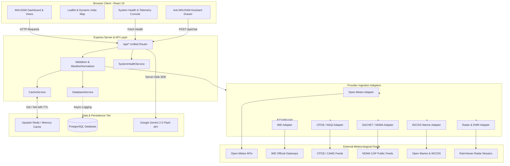

# MAUSAM — Atmospheric Intelligence Platform
> High-Precision Meteorological Observation, Doppler Radar Nowcasting, and Environmental Intelligence for India

[](#system-health--transparency)
[](https://react.dev)
[](https://www.typescriptlang.org/)
[](https://vitejs.dev/)
[](https://tailwindcss.com/)
[](https://expressjs.com/)
[](https://www.postgresql.org/)
[](https://upstash.com/)
[](#license)

---

## Table of Contents

1. [Project Overview](#project-overview)
2. [Problem Statement & Motivation](#problem-statement--motivation)
3. [Core Objectives](#core-objectives)
4. [Free-First Architecture & Ingestion Strategy](#free-first-architecture--ingestion-strategy)
5. [Data Sources & National Providers](#data-sources--national-providers)
6. [System Architecture](#system-architecture)
7. [Core Capabilities](#core-capabilities)
   - [Real-Time Weather & High-Resolution Forecasts](#1-real-time-weather--high-resolution-forecasts)
   - [Doppler Radar Nowcasting & IMD DWR Network](#2-doppler-radar-nowcasting--imd-dwr-network)
   - [Disaster & Severe Weather Warnings (SACHET / NDMA)](#3-disaster--severe-weather-warnings-sachet--ndma)
   - [National Air Quality Index (NAQI / CPCB)](#4-national-air-quality-index-naqi--cpcb)
   - [Ocean State & Coastal Marine Intelligence (INCOIS)](#5-ocean-state--coastal-marine-intelligence-incois)
   - [Agrometeorology & Crop Advisory Intelligence](#6-agrometeorology--crop-advisory-intelligence)
   - [Ask MAUSAM AI Assistant](#7-ask-mausam-ai-assistant)
8. [Data Transparency & Anti-Fabrication Engine](#data-transparency--anti-fabrication-engine)
9. [Database & Caching Architecture](#database--caching-architecture)
10. [Interactive Maps & Geospatial Visualization](#interactive-maps--geospatial-visualization)
11. [Technology Stack](#technology-stack)
12. [Repository Structure](#repository-structure)
13. [API Reference](#api-reference)
14. [Environment Configuration](#environment-configuration)
15. [Local Development Setup](#local-development-setup)
16. [Production Deployment](#production-deployment)
17. [Security Practices](#security-practices)
18. [Planned & Optional Enhancements](#planned--optional-enhancements)
19. [Data Attribution & Disclaimers](#data-attribution--disclaimers)
20. [License](#license)

---

## Project Overview

**MAUSAM** (मौसम — Sanskrit for *Atmosphere / Season*) is a full-stack, coordinates-first atmospheric intelligence platform purpose-built for the Indian subcontinent. It aggregates, normalizes, and delivers meteorological data, disaster advisories, satellite mosaics, Doppler radar frames, coastal ocean conditions, and agro-climatic intelligence.

Unlike conventional weather applications that mask simulated data or rely entirely on costly commercial APIs with restrictive paywalls, MAUSAM operates on a **zero-fabrication, free-first architecture**. It combines verified open-access numerical weather prediction (NWP) models, official national warning feeds, and regional observation networks with transparent telemetry tracking.

---

## Problem Statement & Motivation

India's geographical diversity—ranging from the high Himalayas to tropical coastal belts and arid plateaus—makes weather forecasting and hazard management uniquely challenging:

- **Fragmented Data Ecosystems**: Official Indian meteorological and environmental data is distributed across disparate departmental agencies (IMD, CPCB, NDMA/SACHET, INCOIS) without a unified, modern API layer.
- **Paywalls & High API Costs**: Commercial weather providers frequently enforce restrictive rate limits or charge steep subscription fees for hyper-local Indian weather data.
- **Prevalence of Synthetic / Fake Data**: Many consumer applications fabricate or extrapolate data when upstream feeds fail, displaying fictitious temperatures or phantom rainfall rather than truthfully reporting sensor downtime.
- **Missing Agro-Climatic Guidance**: Over 50% of India's workforce depends on agriculture, yet accessible, real-time agrometeorological guidance (heat stress, soil moisture deficit, spray windows, monsoon arrival) remains siloed.

MAUSAM solves these challenges by providing a robust, free-first, coordinate-based ingestion engine that enforces data provenance, transparent status labeling, multi-tier caching, and comprehensive environmental analysis.

---

## Core Objectives

- **Coordinates-First Precision**: Anchor every query to precise latitude and longitude coordinates, providing accurate hyper-local observations for any point in India.
- **Zero Synthetic Data**: Guarantee that all displayed parameters stem directly from verified upstream providers or valid physics models. If an upstream service is down or unconfigured, the system reports `UNAVAILABLE` or `NOT CONFIGURED` rather than fabricating values.
- **Free-First Operational Baseline**: Deliver complete national coverage for current weather, hourly forecasts, 7-day projections, air quality, radar, and disaster warnings without requiring commercial API keys.
- **National Government Protocol Alignment**: Map air quality against Indian CPCB National Air Quality Index (NAQI) breakpoints and ingest disaster warnings through NDMA's SACHET Common Alerting Protocol (CAP).
- **Public Resilience & Caching Efficiency**: Minimize upstream load and stay well within rate limits through dual-layer Upstash Redis caching with stale-while-revalidate policies.

---

## Free-First Architecture & Ingestion Strategy

MAUSAM follows a strict **free-first provider prioritization policy**:

```
Client Request (lat, lon)
   │
   ▼
[ 1. Cache Layer ] ── Hit (< TTL) ──► Return Cached Observation + Age
   │
   ▼ Miss or Stale
[ 2. Primary National Provider ] ────► IMD / CPCB / SACHET (if configured)
   │
   ▼ Unconfigured or Timeout
[ 3. Open Global Numerical Baseline ] ► Open-Meteo (ECMWF, GFS, ICON, CAMS)
   │
   ▼
[ 4. Data Validation & Normalization ] ► Schema verification, status tagging
   │
   ▼
[ 5. Cache & Database Write ] ────────► Upstash Redis & PostgreSQL
   │
   ▼
[ 6. Normalized API Response ] ───────► Client with Provenance Metadata
```

1. **Free-First Baseline**: Open-Meteo provides keyless, high-resolution global numerical models (combining ECMWF IFS, GFS, and DWD ICON). It is available out-of-the-box without requiring API credentials.
2. **National Authority Ingestion**: When official IMD or CPCB API credentials/endpoints are configured via environment variables, the system prioritizes them for local surface observations.
3. **Graceful Fallback**: If an official provider encounters network failure or IP access restrictions, the system falls back to the open numerical baseline while transparently flagging `isFallback: true` and identifying the actual data source.

---

## Data Sources & National Providers

| Provider | Category | Primary Focus | Auth Method | Status in System |
|---|---|---|---|---|
| **Open-Meteo** | Open Numerical Models | Current weather, hourly/daily forecasts, solar irradiance, rain | Open / Keyless (CC BY 4.0) | **OPERATIONAL** (Primary baseline) |
| **IMD** (India Meteorological Dept) | National Agency (MoES) | Surface station observations, gridded rainfall, agromet advisories | API Key / IP Access | Supported (Active when configured) |
| **CPCB** (Central Pollution Control Board) | National Agency (MoEFCC) | NAQI index, PM2.5, PM10, NO2, SO2, CO, Ozone | Open / NAQI Standard Breakpoints | **OPERATIONAL** (CAMS NAQI mapping) |
| **SACHET / NDMA** | National Disaster Authority | CAP cyclone, flood, heatwave, thunderstorm alerts | Public CAP Feed (XML/JSON) | **OPERATIONAL** |
| **INCOIS** | Oceanographic Institute (MoES) | Significant wave height, swell period, sea surface temp (SST) | Coastal Boundary Filter + Open Marine | **OPERATIONAL** (Coastal areas) |
| **RainViewer / DWR Network** | Radar Satellite Composite | Doppler radar reflectivity mosaic, rain classification | Open API & Station Metadata | **OPERATIONAL** |
| **Open-Meteo Geocoding** | Geospatial Search | India-biased forward and reverse coordinate geocoding | Keyless Open API | **OPERATIONAL** |
| **AccuWeather** | Commercial Provider | Secondary verification & proprietary indices | API Key | Optional (Active if configured) |
| **Google Weather** | Commercial Provider | Secondary verification | API Key | Optional (Active if configured) |

---

## System Architecture

The MAUSAM platform is divided into a client-side visualization layer, a server-side ingestion and normalization layer, an optional persistent PostgreSQL data store, and a Redis caching tier.



---

## Core Capabilities

### 1. Real-Time Weather & High-Resolution Forecasts
- **Current Conditions**: Temperature, "Feels Like" thermal index, relative humidity, dew point, atmospheric pressure, wind velocity & cardinal direction, wind gusts, UV index, cloud cover, visibility, and 24-hour accumulated rainfall.
- **Hourly Projections**: 24-to-48-hour hourly breakdown of precipitation probability, cloud cover percentages, temperature curves, and wind speed.
- **7-Day Forecast**: Daily maximum/minimum temperature envelopes, daily precipitation totals, sunrise/sunset calculations via SunCalc, and condition codes.

### 2. Doppler Radar Nowcasting & IMD DWR Network
- **Live Reflectivity Composite**: Ingests RainViewer Doppler radar frames over the Indian subcontinent with interactive frame playback, speed controls, and timestamp inspection.
- **Station Network Metadata**: Catalogs India's operational Doppler Weather Radar (DWR) stations (New Delhi, Mumbai, Chennai, Kolkata, Srinagar, Kochi, Agartala, Patna, etc.).
- **Proximity Calculation**: Calculates the user's distance to the nearest operational DWR station, identifying radar band (C-Band, S-Band, X-Band), effective range (250–500 km), and whether the current coordinate is within radar coverage.

### 3. Disaster & Severe Weather Warnings (SACHET / NDMA)
- **CAP Protocol Compliance**: Parses Common Alerting Protocol feeds from the National Disaster Management Authority (NDMA) and SACHET platform.
- **Color-Coded Severity Scale**: Classifies advisories according to national standards:
  - 🟢 **Green**: No Warning / Normal
  - 🟡 **Yellow**: Watch / Be Updated
  - 🟠 **Orange**: Alert / Be Prepared
  - 🔴 **Red**: Warning / Take Action
- **District Targeting**: Filters alerts against selected coordinates and district boundaries, reporting active warnings or a clear status message.

### 4. National Air Quality Index (NAQI / CPCB)
- **Indian NAQI Breakpoints**: Calculates air quality according to the official Indian CPCB sub-index algorithm for $PM_{2.5}$, $PM_{10}$, $NO_2$, $SO_2$, $CO$, and $O_3$:
  - `Good` (0–50) • `Satisfactory` (51–100) • `Moderate` (101–200) • `Poor` (201–300) • `Very Poor` (301–400) • `Severe` (401–500+)
- **Prominent Pollutant**: Identifies the primary driving pollutant and provides health precaution advisories for sensitive groups.

### 5. Ocean State & Coastal Marine Intelligence (INCOIS)
- **Coastal Boundary Enforcement**: Evaluates geographical coordinates against coastal distance thresholds. Inland coordinates automatically report marine telemetry as `UNAVAILABLE` rather than showing misleading offshore data.
- **Ocean Parameters**: Reports significant wave height (m), swell height (m), wave period (s), swell direction, and Sea Surface Temperature (SST in °C).
- **Fishermen & Coastal Advisories**: Flags rough sea warnings and high-wave alerts for coastal districts.

### 6. Agrometeorology & Crop Advisory Intelligence
- **Growing Degree Days (GDD)**: Calculates thermal accumulation for major seasonal crop cycles (Kharif, Rabi, Zaid).
- **Agricultural Stress Flags**: Real-time evaluation of heat stress risks, frost alerts, dry spell streaks, and high-humidity fungal infection windows.
- **Spray & Irrigation Windows**: Evaluates wind velocity, precipitation probability, and soil moisture conditions to recommend optimal chemical spray and irrigation timings.

### 7. Ask MAUSAM AI Assistant
- **Server-Side Google Gen AI**: Powered by Google's `@google/genai` TypeScript SDK using `gemini-2.5-flash`.
- **Atmospheric Context Grounding**: System prompts inject current location telemetry, active NDMA alerts, NAQI readings, and seasonal context directly into the model context window.
- **Bilingual / Plain-Language Responses**: Delivers actionable agricultural, travel, and safety guidance in plain English and Hindi without hallucinations.
- **Zero API Key Leakage**: All AI interactions route through the server-side `/api/chat` proxy; no Gemini API keys are exposed to the client.

---

## Data Transparency & Anti-Fabrication Engine

MAUSAM strictly enforces truth in meteorological reporting. The platform distinguishes between data lifecycle stages across all UI cards and API responses:

| Status Badge | Criteria | Visual Indicator |
|---|---|---|
| `LIVE` | Observed or generated within the last 60 minutes directly from an upstream provider | 🟢 Emerald indicator |
| `RECENT` | Data observed between 60 minutes and 3 hours ago | 🔵 Cyan indicator |
| `STALE` | Cached data older than 3 hours, serving as a fallback during upstream outage | 🟡 Amber indicator |
| `UNAVAILABLE` | Upstream feed down, timeout exceeded, or metric non-applicable (e.g., Marine data for Delhi) | 🔴 Rose indicator |
| `NOT CONFIGURED` | Official integration (e.g., IMD private API key) not present in environment variables | ⚪ Slate indicator |

Every API response carries full attribution metadata:
```json
{
  "status": "success",
  "source": "Open-Meteo",
  "provider": "Open-Meteo",
  "dataStatus": "LIVE",
  "observedAt": "2026-09-10T15:30:00.000Z",
  "receivedAt": "2026-09-10T15:42:32.966Z",
  "cached": true,
  "ageSeconds": 13,
  "primarySource": "Open-Meteo",
  "attribution": "Weather data by Open-Meteo.com under CC BY 4.0",
  "data": { ... }
}
```

---

## Database & Caching Architecture

### Dual-Tier Caching System
1. **Tier 1: Upstash Redis / Vercel KV**
   - Configured via `UPSTASH_REDIS_REST_URL` and `UPSTASH_REDIS_REST_TOKEN` (or `KV_REST_API_URL` / `KV_REST_API_TOKEN`).
   - Uses standard REST calls, making it compatible with serverless, container, and edge environments without persistent socket connections.
   - Enforces specific Time-To-Live (TTL) policies:
     - Current Weather: 10 minutes (600s)
     - Multi-Day Forecast: 30 minutes (1800s)
     - Air Quality (AQI): 30 minutes (1800s)
     - Severe Warnings: 5 minutes (300s)
     - Doppler Radar: 3 minutes (180s)
     - Marine Observations: 30 minutes (1800s)
2. **Tier 2: In-Memory Fallback**
   - If Redis credentials are not provided, the platform gracefully switches to an in-memory cache with eviction and TTL expiration.
   - Transparently tracked in `/api/system/health` under `cache.provider: "IN_MEMORY_DEGRADED"`.

### PostgreSQL Database Support (Neon / Supabase / Self-Hosted)
- Initialized lazily via the standard `pg` Pool library using `DATABASE_URL` or `POSTGRES_URL`.
- If no database is configured, database logging is skipped without impacting application runtime.
- When connected, the database maintains:
  - `weather_observations`: Historical surface station observations and conditions.
  - `forecast_snapshots`: Model run forecasts for trend verification.
  - `active_warnings`: Historical archive of NDMA/SACHET disaster alerts.
  - `air_quality_logs`: Pollutant concentration time-series.
  - `provider_health_logs`: Endpoint availability, latency, and error tracking.

---

## Interactive Maps & Geospatial Visualization

- **Leaflet & React-Leaflet (`react-leaflet: ^5.0.0`)**: Renders interactive map stages with responsive container sizing via `ResizeObserver`.
- **National Radar Layer**: Overlays RainViewer Doppler precipitation tiles with smooth opacity controls and time-slider scrubbing.
- **IMD Doppler Radar Stations**: Interactive markers highlighting station metadata, radar band, range ring boundaries, and operational status.
- **Dynamic India Regional Map (`@svg-maps/india`)**: Vector-based choropleth and regional selector for quick inspection of states and union territories.
- **Air Quality Heatmap**: Visualizes spatial distribution of NAQI categories across monitored stations.

---

## Technology Stack

| Layer | Technology | Version / Specification | Role in Project |
|---|---|---|---|
| **Frontend Framework** | React | `^19.0.1` | Core UI component hierarchy and hooks |
| **Language** | TypeScript | `~5.8.2` | End-to-end type safety across client and server |
| **Build Tooling** | Vite | `^6.2.3` | Development server and production bundling |
| **Styling** | Tailwind CSS | `^4.1.14` | Utility-first responsive design tokens |
| **Animations** | Motion | `^12.23.24` | Transitions and drawer animations |
| **Icons** | Lucide React | `^0.546.0` | Accessible SVG icon suite |
| **Maps & Geospatial** | Leaflet & React-Leaflet | `^1.9.4` / `^5.0.0` | Interactive tile layers and station markers |
| **Vector Maps** | `@svg-maps/india` | `^2.0.0` | SVG map of India states and territories |
| **Data Visualization**| Recharts | `^3.10.1` | Temperature curves, humidity, and barometric charts |
| **Solar Calculations** | SunCalc | `^2.0.2` | Precise local sunrise, sunset, and solar noon |
| **Markdown** | React-Markdown & GFM | `^10.1.0` / `^4.0.1`| AI advisory rendering and technical documentation |
| **Backend Runtime** | Node.js + Express | `^4.21.2` | Unified REST API server and reverse proxy |
| **Server TypeScript**| `tsx` & `esbuild` | `^4.21.0` / `^0.25.0`| Production single-file CommonJS bundling (`dist/server.cjs`) |
| **Database** | PostgreSQL (`pg`) | `^8.23.0` | Relational storage for observations and health logs |
| **Cache** | Upstash Redis REST | REST API / In-Memory | Distributed caching with TTL and stale fallbacks |
| **AI Engine** | Google Gen AI SDK | `@google/genai: ^2.4.0` | Server-side Gemini 2.5 Flash atmospheric assistant |
| **Validation** | Zod | `^4.5.4` | Data validation and schema parsing |

---

## Repository Structure

```
.
├── backend/                        # Centralized Backend & Ingestion Architecture
│   ├── cache/                      # Redis (Upstash) & In-Memory Caching Engine
│   │   └── cacheService.ts         # Dual-tier cache with TTL and key generation
│   ├── database/                   # PostgreSQL Schema & Connection Manager
│   │   └── db.ts                   # Lazy-initialized pg.Pool & table migrations
│   ├── normalization/              # Weather Normalization & Standard Types
│   │   ├── types.ts                # NormalizedWeather, Forecast, AQI, Marine types
│   │   └── weatherNormalizer.ts    # Unit conversions, NAQI calculation, status tags
│   ├── providers/                  # Upstream Meteorological Adapters
│   │   ├── openMeteo.ts            # Keyless numerical forecast adapter (ECMWF, GFS)
│   │   ├── imd.ts                  # India Meteorological Dept adapter & verification
│   │   ├── cpcb.ts                 # CPCB air quality and NAQI index calculations
│   │   ├── sachet.ts               # NDMA SACHET CAP disaster alert parser
│   │   ├── incois.ts               # INCOIS marine adapter & coastal boundary filter
│   │   ├── radar.ts                # RainViewer Doppler radar frames adapter
│   │   ├── accuweather.ts          # Optional commercial provider adapter
│   │   └── googleWeather.ts        # Optional commercial provider adapter
│   └── services/                   # Business Logic & Orchestration Services
│       ├── weatherService.ts       # Current weather, hourly, and multi-day forecasts
│       ├── warningService.ts       # CAP disaster alert filtering by coordinate
│       ├── aqiService.ts           # Air quality observations and health advice
│       ├── marineService.ts        # Coastal ocean state with inland filtering
│       ├── radarService.ts         # Radar mosaic frames & nearest DWR station lookup
│       ├── stationService.ts       # Surface and radar station catalog
│       ├── locationService.ts      # Forward/reverse geocoding for Indian locations
│       └── systemHealthService.ts  # Telemetry, latencies, error counts, cache ratios
├── server/                         # Express Server Route Handlers
│   └── routes/
│       ├── unifiedApiRoutes.ts     # Unified /api/* endpoints (Coordinates-First)
│       ├── imdRoutes.ts            # Official IMD station connector routes
│       ├── multiSourceRoutes.ts    # Multi-source health and legacy endpoints
│       └── realMausamRoutes.ts     # Auxiliary atmospheric and solar endpoints
├── src/                            # Frontend Application (React 19 + TypeScript)
│   ├── components/                 # Reusable UI & Subsystem Components
│   │   ├── common/                 # Shared components (MausamDataHealth, IstClock)
│   │   ├── weather/                # Weather cards, metrics, and hourly sliders
│   │   ├── radar/                  # Radar player, station overlays, and controls
│   │   ├── alerts/                 # NDMA warning cards and alert ticker
│   │   ├── agromet/                # Agricultural advisories, GDD, spray windows
│   │   └── AskMausamDrawer.tsx     # Gemini-powered atmospheric assistant
│   ├── context/                    # React Context Providers (Location, Theme)
│   ├── data/                       # Static station metadata (DWR radars, cities)
│   ├── pages/                      # Application Route Views
│   │   ├── Home.tsx                # Primary atmospheric overview dashboard
│   │   ├── Weather.tsx             # In-depth meteorological analysis
│   │   ├── Radar.tsx               # Dedicated Doppler radar interactive viewer
│   │   ├── Alerts.tsx              # Disaster advisories and active CAP warnings
│   │   ├── AirQuality.tsx          # CPCB NAQI breakdown and pollutant maps
│   │   ├── Agromet.tsx             # Farmer and crop advisory dashboard
│   │   ├── OpenDataApi.tsx         # Open Data API documentation & playground
│   │   └── ApiDebug.tsx            # Live telemetry, cache, and provider inspector
│   ├── services/                   # Client-side API consumers
│   │   ├── api.ts                  # Axios/fetch wrappers for /api/*
│   │   └── multiSourceService.ts   # System health and diagnostics client
│   ├── App.tsx                     # Main layout and view router
│   ├── main.tsx                    # React application entry point
│   └── index.css                   # Tailwind CSS v4 entry point
├── public/                         # Static assets, icons, and favicon
├── server.ts                       # Express Application Entry Point & Vite Middleware
├── package.json                    # Project dependencies and build scripts
├── vite.config.ts                  # Vite + React + Tailwind CSS configuration
├── tsconfig.json                   # TypeScript compiler configuration
└── metadata.json                   # Application metadata & frame permissions
```

---

## API Reference

The unified API router is mounted under `/api/*`. All atmospheric endpoints prioritize `lat` and `lon` query parameters.

### Atmospheric Endpoints

| Method | Endpoint | Query Parameters | Description |
|---|---|---|---|
| `GET` | `/api/weather/current` | `lat`, `lon`, `name` | Current atmospheric conditions, thermal metrics, and provenance |
| `GET` | `/api/weather/forecast` | `lat`, `lon` | 7-day daily forecast with extremes, precipitation probabilities |
| `GET` | `/api/weather/hourly` | `lat`, `lon` | 24-to-48-hour hourly progression of weather parameters |
| `GET` | `/api/weather/daily` | `lat`, `lon` | Aggregated daily forecast array |
| `GET` | `/api/air-quality` | `lat`, `lon` | CPCB NAQI calculation, individual pollutant levels, health advice |
| `GET` | `/api/warnings` | `lat`, `lon`, `district`, `state` | Active NDMA/SACHET CAP severe weather warnings |
| `GET` | `/api/marine` | `lat`, `lon` | Wave height, swell, and SST (inland coordinates return `UNAVAILABLE`) |
| `GET` | `/api/radar` | `lat`, `lon` | Latest RainViewer radar mosaic frame and nearest DWR station metadata |
| `GET` | `/api/stations` | `lat`, `lon`, `count` | Nearest surface meteorological and radar stations |
| `GET` | `/api/locations/search` | `q`, `count` | Indian geocoding search for cities, towns, and districts |
| `POST`| `/api/chat` | JSON Body: `{ message, context }`| Server-side Gemini atmospheric assistant query |

### System Health & Telemetry

| Method | Endpoint | Description |
|---|---|---|
| `GET` | `/api/system/health` | Live diagnostic payload: database status, cache hit ratios, and individual provider latencies |
| `GET` | `/api/health` | Lightweight service health ping |

---

## Environment Configuration

Create a `.env` file in the project root based on `.env.example`. **No API keys are required for basic local operation**—the platform will run using the free baseline providers and in-memory caching.

```env
# ====================================================================
# MAUSAM - Environment Configuration Template
# ====================================================================

# 1. PostgreSQL Database (Optional - Neon / Supabase / Local)
DATABASE_URL=
POSTGRES_URL=

# 2. Redis Persistent Cache (Optional - Upstash Redis REST / Vercel KV)
UPSTASH_REDIS_REST_URL=
UPSTASH_REDIS_REST_TOKEN=
KV_REST_API_URL=
KV_REST_API_TOKEN=

# 3. National Government Providers (Optional)
IMD_ENABLED=false
IMD_API_BASE_URL=https://api.imd.gov.in/api/v1
IMD_API_KEY=

CPCB_ENABLED=true
CPCB_API_KEY=

SACHET_ENABLED=true
SACHET_FEED_URL=https://sachet.ndma.gov.in/cap_public_website/FetchAllAlertDetails

INCOIS_ENABLED=true
INCOIS_BASE_URL=https://incois.gov.in

RADAR_ENABLED=true

# 4. Commercial Providers (Optional)
ACCUWEATHER_API_KEY=
GOOGLE_WEATHER_API_KEY=

# 5. Server-Side AI Assistant (Optional)
GEMINI_API_KEY=

# 6. Environment
NODE_ENV=development
```

> **Security Notice**: Never commit `.env` files containing live secrets to version control. The repository `.gitignore` automatically excludes all local environment files.

---

## Local Development Setup

### Prerequisites
- **Node.js**: `v20.x` or `v22.x` (LTS recommended)
- **npm**: `v10.x` or later (or `bun` / `pnpm`)

### 1. Clone the Repository
```bash
git clone https://github.com/your-username/mausam-platform.git
cd mausam-platform
```

### 2. Install Dependencies
```bash
npm install
```

### 3. Configure Environment Variables
```bash
cp .env.example .env
```
*(Optional: Add `GEMINI_API_KEY` for AI features or `DATABASE_URL` for persistent logging. Leave empty for free baseline operation).*

### 4. Run the Development Server
```bash
npm run dev
```
The application will boot on `http://localhost:3000`. In development mode:
- Express serves the backend API routes on `/api/*`.
- Vite runs as middleware, compiling React components with Hot Module Replacement.

### 5. Run Linter & Type Check
```bash
npm run lint
```

---

## Production Deployment

### Building for Production
The build script bundles the Vite client into `dist/` and compiles `server.ts` into a single, self-contained CommonJS binary at `dist/server.cjs` using `esbuild`:

```bash
npm run build
```

### Running in Production
```bash
npm start
```
This executes `node dist/server.cjs`, serving the optimized static assets from `dist/` and hosting the unified `/api/*` endpoints.

### Deploying to Vercel
1. Link your repository to Vercel.
2. Vercel automatically detects Vite and the output directory `dist`.
3. Configure environment variables in the Vercel Project Settings:
   - `DATABASE_URL` (e.g., from Neon or Supabase)
   - `UPSTASH_REDIS_REST_URL` & `UPSTASH_REDIS_REST_TOKEN` (from Upstash)
   - `GEMINI_API_KEY` (from Google AI Studio)
4. Deploy. The platform leverages Vercel KV / Upstash Redis for serverless caching.

---

## Security Practices

- **Zero Client-Side Secrets**: All third-party credentials (`GEMINI_API_KEY`, `IMD_API_KEY`, database passwords) are strictly confined to the server-side environment. No secrets are prefixed with `VITE_`.
- **Coordinates Sanitization**: All incoming query coordinates are validated and bounded to valid geographical ranges ($-90 \le \text{lat} \le 90$, $-180 \le \text{lon} \le 180$) to prevent injection.
- **Fail-Safe Lazy Initialization**: SDKs that require credentials (e.g., Gemini GenAI, PostgreSQL Pool) initialize lazily. If a key is missing, only that specific feature is disabled gracefully without crashing the server.
- **Content Security & Safe Links**: All external portal links use `rel="noreferrer"` and `target="_blank"`. Images load with safe referrer policies.

---

## Planned & Optional Enhancements

The following features represent architectural targets planned for future iterations:

- **Crowdsourced Weather Validation**: *[Planned]* Citizen rainfall and storm reporting with anomaly-filtering heuristics.
- **Offline PWA & Service Worker**: *[Planned]* Local IndexedDB storage for offline access to recent forecasts and emergency contacts.
- **Direct INSAT-3D Satellite Imagery**: *[Planned]* Direct infrared and visible satellite composite feeds from ISRO MOSDAC.
- **Multilingual UI (10+ Indian Languages)**: *[Planned]* Complete localization for Hindi, Bengali, Telugu, Tamil, Marathi, Gujarati, Kannada, and Punjabi.
- **SMS / WhatsApp Disaster Alerts**: *[Optional]* Webhook integration with Twilio/Gupshup for critical Red Alert push notifications to rural communities.

---

## Data Attribution & Disclaimers

MAUSAM aggregates open and official public data sources. All intellectual property, trademarks, and observational records belong to their respective authorities:

- **India Meteorological Department (IMD)**: Ministry of Earth Sciences, Government of India. Official meteorological observation, forecast models, and Doppler weather radar stations ([mausam.imd.gov.in](https://mausam.imd.gov.in)).
- **Central Pollution Control Board (CPCB)**: Ministry of Environment, Forest and Climate Change, Government of India. National Air Quality Index (NAQI) standards ([cpcb.nic.in](https://cpcb.nic.in)).
- **National Disaster Management Authority (NDMA) & SACHET**: Government of India Common Alerting Protocol ([sachet.ndma.gov.in](https://sachet.ndma.gov.in)).
- **Indian National Centre for Ocean Information Services (INCOIS)**: Ministry of Earth Sciences, Government of India ([incois.gov.in](https://incois.gov.in)).
- **Open-Meteo**: Numerical weather prediction models under the Creative Commons Attribution 4.0 International (CC BY 4.0) license ([open-meteo.com](https://open-meteo.com)).
- **RainViewer**: Open weather maps Doppler radar mosaic API ([rainviewer.com](https://www.rainviewer.com/api.html)).

*Disclaimer: MAUSAM is an atmospheric intelligence platform designed for public information, research, and situational awareness. During active national emergencies, cyclones, or catastrophic disasters, always prioritize official statutory directives issued directly by the NDMA, IMD, and State Disaster Management Authorities (SDMA).*

---

## License

This project is open-source and distributed under the **MIT License**. See the [LICENSE](LICENSE) file for complete details.
